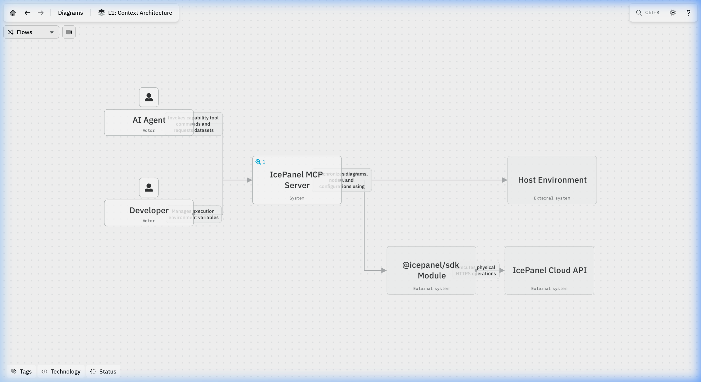
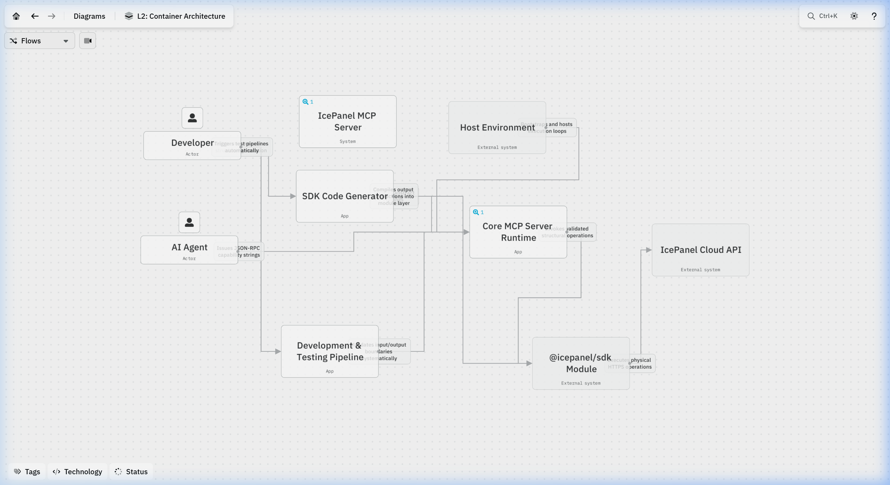
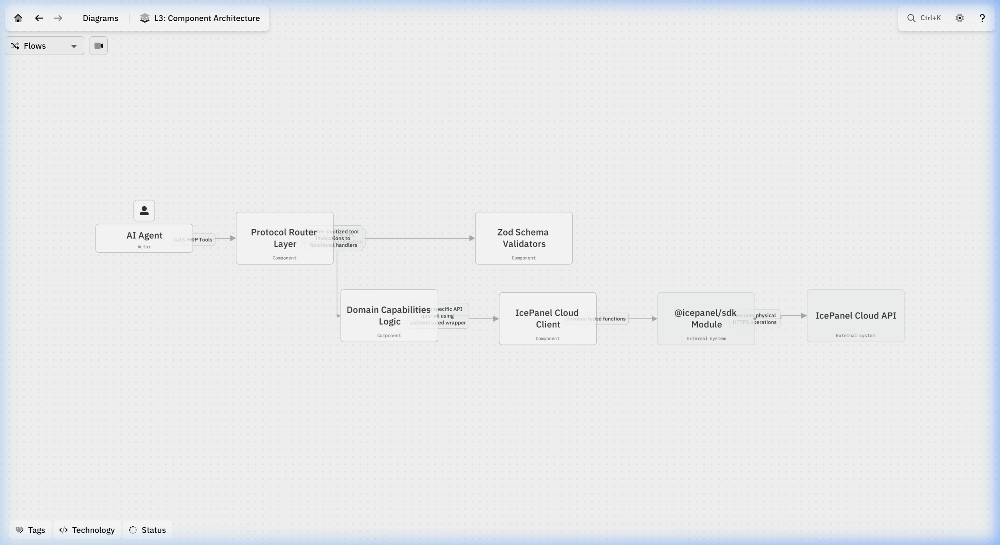

# IcePanel MCP Server

MCP server for the [IcePanel](https://icepanel.io) API.

## Architectural Documentation

The source codebase has been seamlessly mapped through the C4 architectural abstraction directly integrating via **IcePanel Cloud**. 

- **C4 Context (L1)**: Maps the physical boundaries separating the standard Developer environments, AI Agents, and the standard Host systems executing node instances bridging to the Remote API.
- **C4 Containers (L2)**: Granular separation of the local REST Server interceptor versus the native TypeScript SDK layer passing boundaries explicitly.
- **C4 Components (L3)**: Strict domain separation isolating the generic **Protocol Router Layer**, the strict **Zod Schema Validators**, the executing **Domain Capabilities**, and the outbound **Cloud Client**.

### Execution Flows (L1-L3)

Each structural map hosts autonomous, step-by-step chronological flows defining explicit component boundaries:
1. **Developer Setup & Deployment Lifecycle** (`L1`): Traces physical environment instantiation variables mapping locally.
2. **System Context Data Synchronization** (`L1`): Tracks the broad sequence of AI Agents requesting capability execution schemas mapping to remote mutations.
3. **Schema Generation Deep-Dive** (`L2`): Outlines the local AST type-safe scanning extraction compiling models offline.
4. **Internal API Capabilities Execution** (`L2`): Maps physical REST wrapper sequences passing secure payload arguments into the verified SDK logic endpoints.
5. **Tool Execution Pipeline** (`L3`): Evaluates granular JSON-RPC strings hitting standard router edges, resolving against Zod schemas, into discrete structural domains.
6. **Cloud Payload Transmission** (`L3`): Resolves strict capabilities mapping secure Bearer structures passing via physical HTTP interfaces terminating onto IcePanel graph clusters.

> **Visual Demonstration**:
>
> 

## Features

The formal architecture of this repository across all execution contexts is rigorously modeled according to the C4 methodology.

- **[System Context (L1)](docs/c4-context.md)**: Defines the overarching ecosystem, actors, and remote endpoint boundaries.
- **[Container Architecture (L2)](docs/c4-container.md)**: The 9 major independent execution pipelines and configuration blocks.
- **[Component Graph (L3)](docs/c4-component.md)**: A physical 1-to-1 graph comprehensively mapping every single TypeScript logic file, JSON schema, and Vitest suite across the entire repository.

> 📊 **[View Interactive Architecture Diagrams on IcePanel](https://s.icepanel.io/W4aTobhklkvDMF/Lc23)**

### L1: Context Architecture


### L2: Container Architecture


### L3: Component Architecture


## Features

- 🔍 **Zero-config discovery** — `find_tool` searches all tools by name, description, or module
- ⚡ **Universal executor** — `run_tool` dynamically invokes any discovered tool
- 🔄 **Batch pipelines** — `batch_run_tool` executes arrays of tools chronologically across domains
- 📦 **Modular loading** — `?modules=diagrams,model` loads only what you need

## Deployment & Client Configuration

The server gracefully supports two explicit deployment strategies mapping strict execution environments dynamically natively utilizing blazing fast Server-Sent Events (SSE) securely natively across all MCP clients (`mcp_config.json`, Claude Desktop, Google Antigravity, etc):

### Option A: Local Docker Proxy (Stdio JSON-RPC)
Runs the server independently on your local machine using standard input/output (stdio) pipelines via Docker. This explicitly bypasses local network restrictions, corporate VPNs, and TLS interception organically natively.
1. Configure your `.env` with `DOCKER_ICEPANEL_API_KEY=your_key`
2. `docker compose up -d` (Boots the persistent STDIN local background proxy)

**mcp_config.json Payload for Cursor/Claude Desktop:**
```json
"ice-panel": {
  "command": "docker",
  "args": [
    "exec",
    "-i",
    "ice-panel-mcp",
    "npx",
    "tsx",
    "src/stdio.ts"
  ],
  "disabled": false
}
```

### Option B: Edge Serverless API (Cloudflare Workers SSE)
Instantly binds the exact AST extraction architecture universally publicly onto your secure edge domain without requiring specific execution proxies gracefully deployed to zero-maintenance global endpoints.
1. `pnpm run deploy` 

**mcp_config.json Payload:**
```json
"ice-panel": {
  "serverUrl": "https://ice-panel-mcp.<your-subdomain>.workers.dev/mcp",
  "headers": {
    "Authorization": "Bearer <YOUR_ICEPANEL_API_KEY>"
  }
}
```

Generate an API token from [IcePanel Settings](https://app.icepanel.io).

## Available Scripts

This project includes the following `pnpm` scripts:

| Command | Description |
|---|---|
| `pnpm run dev` (or `start`) | Starts the local `wrangler dev` server on `http://localhost:8787/mcp`. |
| `pnpm run deploy` | Deploys the production build to Cloudflare Workers. |
| `pnpm run codegen` | Automatically regenerates all SDK tool wrappers inside `src/`. |
| `pnpm test` | Runs the offline unit test suite checking output serialization. |
| `pnpm run test:coverage` | Runs unit tests and yields the Istanbul code coverage breakdown. |
| `pnpm run test:e2e` | Runs the live integration suite testing upstream IcePanel API connectivity. |
| `pnpm run cf-typegen` | Updates Cloudflare environment types. |
| `pnpm run docker:build` | Compiles the standalone STDIN Docker proxy image locally. |
| `pnpm run docker:run` | Executes the container interactively bridging the STDIN pipeline. |
| `pnpm run docker:start` | Unpacks the native Node.js `stdio` interceptor (entrypoint inside Docker). |

## Development

Tool wrappers are auto-generated from the [@icepanel/sdk](https://www.npmjs.com/package/@icepanel/sdk) NPM package types, managed directly from the official [IcePanel/icepanel-js](https://github.com/IcePanel/icepanel-js) repository.

```bash
pnpm install
pnpm run codegen
pnpm run dev
```

## Testing

### Unit Tests & Coverage

We maintain 100% test coverage across all generated wrappers and schemas locally.

```bash
pnpm test
pnpm run test:coverage 
```

```text
-------------------|---------|----------|---------|---------|-------------------
File               | % Stmts | % Branch | % Funcs | % Lines | Uncovered Line #s 
-------------------|---------|----------|---------|---------|-------------------
All files          |   99.09 |    94.25 |    98.8 |   99.08 |                   
 src               |   68.75 |    72.22 |      50 |   68.75 |                   
  agent.ts         |      50 |    33.33 |      50 |      50 | 13,28-35          
  index.ts         |   91.66 |       90 |      50 |   91.66 | 22                
  schemas.ts       |       0 |      100 |     100 |       0 | 4-61              
  stdio.ts         |     100 |      100 |     100 |     100 |                   
 src/generated     |     100 |      100 |     100 |     100 |                   
  ...og-schemas.ts |     100 |      100 |     100 |     100 |                   
  catalog.ts       |     100 |      100 |     100 |     100 |                   
  ...ts-schemas.ts |     100 |      100 |     100 |     100 |                   
  comments.ts      |     100 |      100 |     100 |     100 |                   
  ...ms-schemas.ts |     100 |      100 |     100 |     100 |                   
  diagrams.ts      |     100 |      100 |     100 |     100 |                   
  ...ns-schemas.ts |     100 |      100 |     100 |     100 |                   
  domains.ts       |     100 |      100 |     100 |     100 |                   
  ...ts-schemas.ts |     100 |      100 |     100 |     100 |                   
  drafts.ts        |     100 |      100 |     100 |     100 |                   
  ...ol-schemas.ts |     100 |      100 |     100 |     100 |                   
  find_tool.ts     |     100 |      100 |     100 |     100 |                   
  flows-schemas.ts |     100 |      100 |     100 |     100 |                   
  flows.ts         |     100 |      100 |     100 |     100 |                   
  index.ts         |     100 |      100 |     100 |     100 |                   
  ...es-schemas.ts |     100 |      100 |     100 |     100 |                   
  landscapes.ts    |     100 |      100 |     100 |     100 |                   
  model-schemas.ts |     100 |      100 |     100 |     100 |                   
  model.ts         |     100 |      100 |     100 |     100 |                   
  ...ns-schemas.ts |     100 |      100 |     100 |     100 |                   
  organizations.ts |     100 |      100 |     100 |     100 |                   
  ...nk-schemas.ts |     100 |      100 |     100 |     100 |                   
  shareLink.ts     |     100 |      100 |     100 |     100 |                   
  tags-schemas.ts  |     100 |      100 |     100 |     100 |                   
  tags.ts          |     100 |      100 |     100 |     100 |                   
  teams-schemas.ts |     100 |      100 |     100 |     100 |                   
  teams.ts         |     100 |      100 |     100 |     100 |                   
  ...ns-schemas.ts |     100 |      100 |     100 |     100 |                   
  versions.ts      |     100 |      100 |     100 |     100 |                   
-------------------|---------|----------|---------|---------|-------------------
```

### End-to-End Testing

To run the live E2E test suite against the actual IcePanel API:

1. Create a `.env` file in the root directory:
   ```env
   E2E_TEST_ICEPANEL_API_KEY=your_api_key_here
   ```
2. Start the local server in one terminal: `pnpm run dev`
3. Run the E2E suite in another terminal: `pnpm run test:e2e`

#### Known Limitations (Skipped Tests)

The E2E suite contains 48 exhaustive assertions. Two tests are formally tracked as conditionally skipped (`it.skip`) to account for proven upstream constraints in the IcePanel API when authenticating via API Keys:
1. **`delete_comments_replies`**: Throws a `401 Unauthorized` ("Comment reply was created by another user") because the backend lacks identity tracking for API Keys exclusively on this nested route.
2. **`create_versions_reverts`**: Throws a `422 Unprocessable Entity` ("User not provided") because restoring a version demands a user profile that API Keys do not inherently possess.