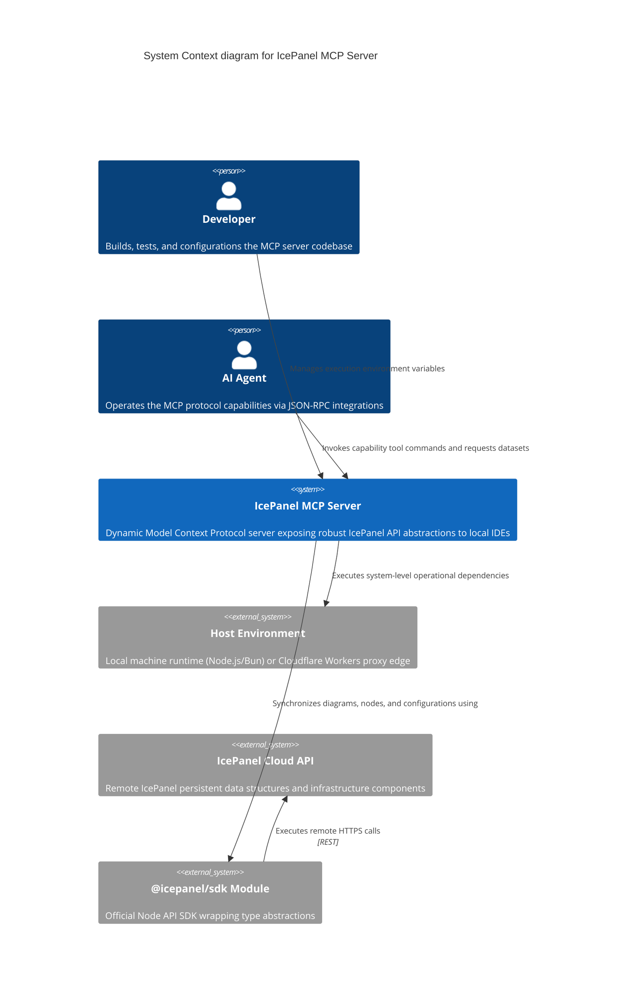
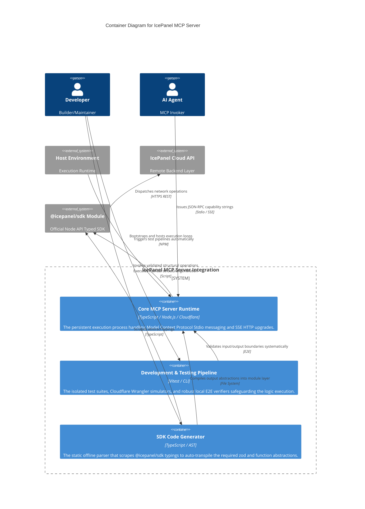
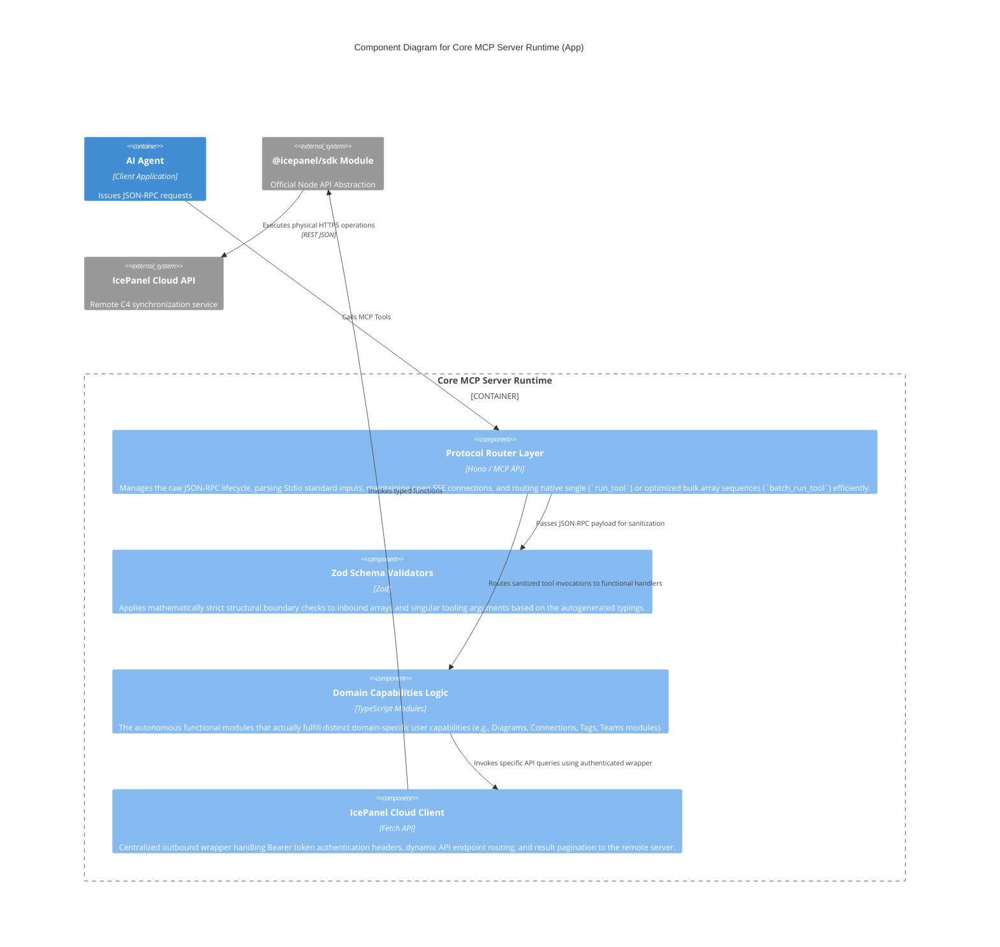

# IcePanel MCP Server Architecture

> 📊 **[View Interactive Architecture Diagrams on IcePanel](https://s.icepanel.io/W4aTobhklkvDMF/Lc23)**

## Executive Summary

The IcePanel MCP Server serves as the critical connective tissue between intelligent local agents (like IDE assistants) and the remote IcePanel Cloud ecosystem. Implementating the robust Model Context Protocol (MCP), it exposes deep domain capabilities via a dynamically generated, mathematically strict JSON-RPC interface. This empowers end-users and AI systems to autonomously query, mutate, and synchronize complex C4 models utilizing native typings bridged synchronously with the official `@icepanel/sdk`.

---

## 1. System Architecture (Level 1)

The macro-level interaction boundaries bridging external dependencies and runtime operators.

---

## 2. Container Architecture (Level 2)

The fundamental application modules and processes segregating runtime boundaries, structural testing, and abstract transpilation loops.

---

## 3. Component Architecture (Level 3)

Granular decoupling of internal executable dependencies physically homed within the Core Runtime process.

---

## 4. Deployment & Testing Flow

The IcePanel MCP Server ecosystem strongly isolates static operational pipelines from real-time persistent execution:

1. **Typings Scrapers**: The `codegenPipeline` container independently invokes offline AST parsers on official typings, physically emitting structural bindings into the `File System`. These rigid boundary schemas guarantee mathematical safety before instantiation.
2. **Local Simulation Validation**: Operations are funneled through the strict `Development & Testing Pipeline` containing exhaustive `Vitest` unit checks and robust `E2E` runtime checks validating the `Stido/SSE` abstractions.
3. **Execution Runtime Contexts**: Natively compiled server logic dynamically boots under specific Node.js or Cloudflare Wrangler Host Environments, executing identical domain handlers. 
4. **Cloud API Resolution**: Synchronous interactions physically traverse the `Official API SDK` wrapping logic before securely concluding at the actual persistent IcePanel Cloud databases via tokenized HTTPS REST interfaces.
