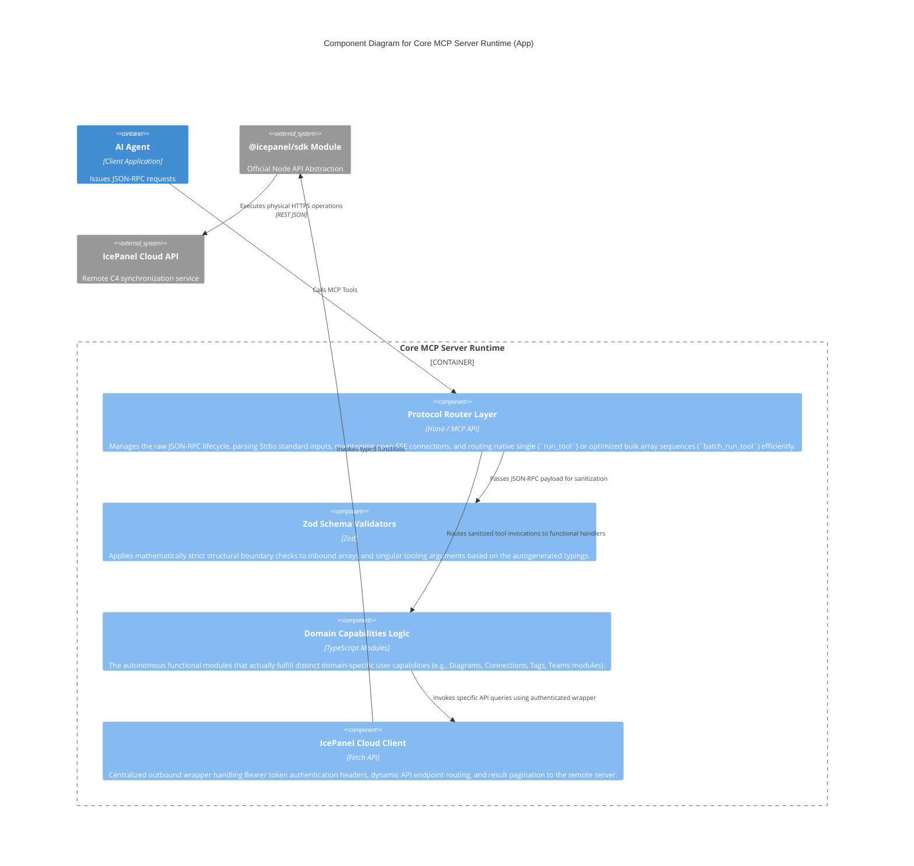

# Component Architecture (Level 3)
Zooming into the `Core MCP Server Runtime` container to visualize its internal architecture. The core application logic is logically structured into cohesive domain boundaries rather than a 1:1 mapping of single physical scripts, promoting clean decoupling.

