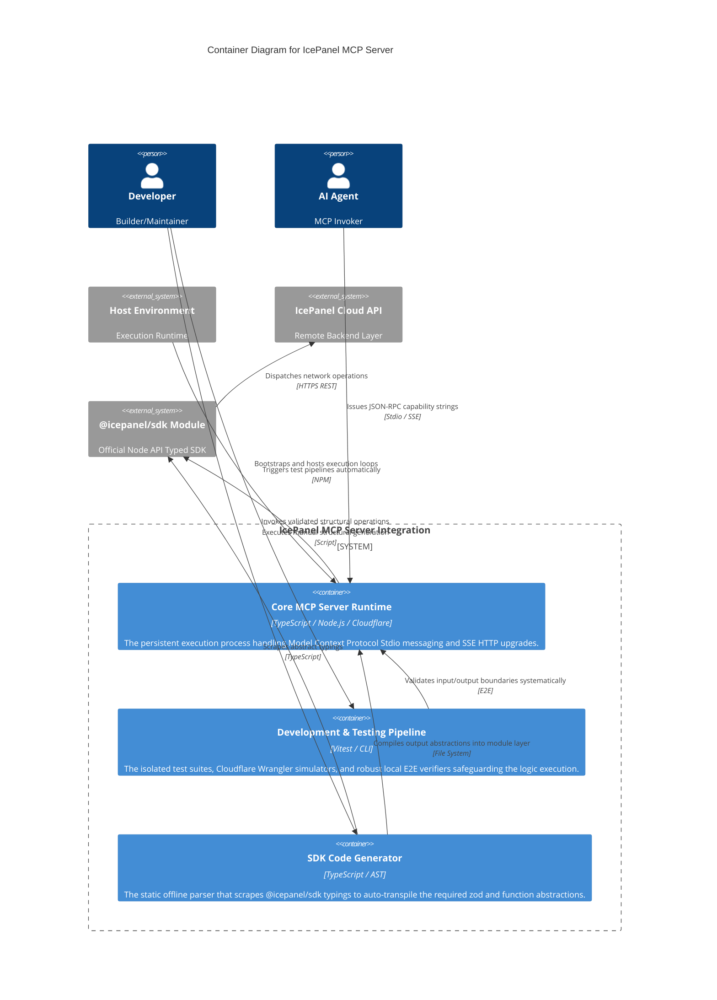

# Container Architecture (Level 2)
The structural subdivision of the IcePanel MCP ecosystem into independent processes representing the core execution loop, testing infrastructure, and codebase generation.

