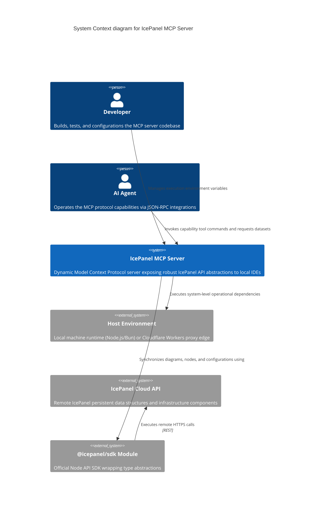

# Context Architecture (Level 1)
The structural context boundaries defining how external operators and dependent external systems interact with the IcePanel MCP service.

```mermaid
C4Context
  title System Context diagram for IcePanel MCP Server

  Person(developer, "Developer", "Builds, tests, and configurations the MCP server codebase")
  Person(aiAgent, "AI Agent", "Operates the MCP protocol capabilities via JSON-RPC integrations")

  System(icepanelMcpServer, "IcePanel MCP Server", "Dynamic Model Context Protocol server exposing robust IcePanel API abstractions to local IDEs")

  System_Ext(hostEnvironment, "Host Environment", "Local machine runtime (Node.js/Bun) or Cloudflare Workers proxy edge")
  System_Ext(icepanelApi, "IcePanel Cloud API", "Remote IcePanel persistent data structures and infrastructure components")
  System_Ext(icepanelSdk, "@icepanel/sdk Module", "Official Node API SDK wrapping type abstractions")

  Rel(aiAgent, icepanelMcpServer, "Invokes capability tool commands and requests datasets")
  Rel(developer, icepanelMcpServer, "Manages execution environment variables")
  
  Rel(icepanelMcpServer, icepanelSdk, "Synchronizes diagrams, nodes, and configurations using")
  Rel(icepanelSdk, icepanelApi, "Executes remote HTTPS calls", "REST")
  Rel(icepanelMcpServer, hostEnvironment, "Executes system-level operational dependencies")
```
